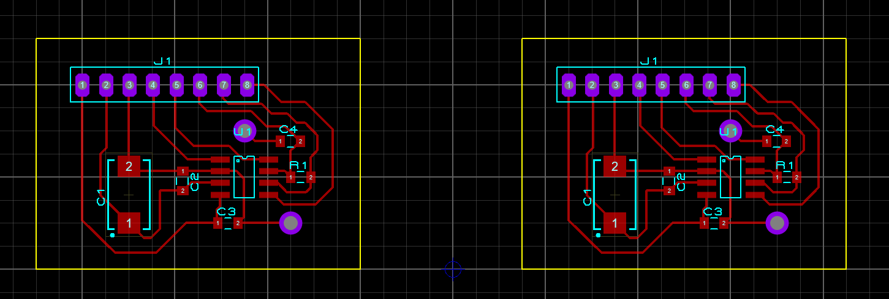

# 🛰️ STM32F4 CAN Bus Mastery Course Projects

This repository contains all the practical projects developed during the **"STM32F4 Discovery Kartı ile CAN Bus Kursu"** by Instructor Muhammed Fatih KÖSEOĞLU. The projects demonstrate a complete mastery of the **CAN Bus (Controller Area Network)** protocol, ranging from theoretical foundations to complex multi-node sensor telemetry.

---

## 🚀 Key Learning Outcomes & Features
- **Protocol Depth:** Implementation of both **Standard (11-bit)** and **Extended (29-bit)** CAN IDs.
- **Hardware Filtering:** Advanced message filtering using **Mask** and **List** modes to optimize bus traffic.
- **Peripheral Integration:** Interfacing **ADC**, **I2C (2x16 LCD)**, and **HC-SR04** ultrasonic sensors over the CAN network.
- **Toolchain:** Extensive use of **STM32CubeMX** for peripheral configuration and hardware initialization.

---

## 📁 Project Breakdown

### 1. Basic Communication & ID Basics
Initial tests for sending and receiving frames using Standard ID format.

### 2. Message Filtering (ID Mask & List)
Detailed implementation of hardware filters to accept specific message IDs while ignoring others, ensuring efficient CPU usage.

### 3. Extended ID (ExtID) Messaging
Developing communication logic for Extended ID frames, essential for SAE J1939 and advanced automotive standards.

### 4. CAN-Bus Telemetry Systems
- **ADC to I2C LCD:** Reading analog data and transmitting it via CAN to another node for display on a 2x16 LCD.
- **Distance Sensing:** Real-time distance measurement using HC-SR04, transmitted over CAN using Extended IDs.

---

## 📐 Hardware & PCB Design (Proteus)

In addition to the firmware development, this repository includes a complete hardware design for CAN Bus communication nodes.

- **Design Tool:** Proteus Professional
- **File Name:** `STM32F4_CAN_Bus_Module_Schematic`
- **Features:** - Dual-node CAN transceiver circuit implementation.
    - Proper signal routing for differential CAN_H and CAN_L lines.
    - Integrated bypass capacitors and termination resistor footprints for bus stability.

    
    *Figure 1: Professional PCB layout design for dual CAN Bus nodes in Proteus, featuring optimized differential pair routing.*

---

### 🛠️ Hardware Requirements
- **Microcontroller:** STM32F407VGT6 (Discovery Board).
- **Transceiver:** MCP2551 or TJA1050 CAN Transceiver modules.
- **Sensors:** HC-SR04 Ultrasonic Sensor, Potentiometers.
- **Display:** 2x16 I2C LCD.

---

## 👨‍💻 About the Author
**Electrical-Electronics Engineering Student**
* Focused on Embedded Systems, Control Systems, and Defense Technologies.
* YouTube Channel: [CozumLab](https://www.youtube.com/@CozumLab)
* Actively developing projects for competitive engineering environments like **TEKNOFEST**.